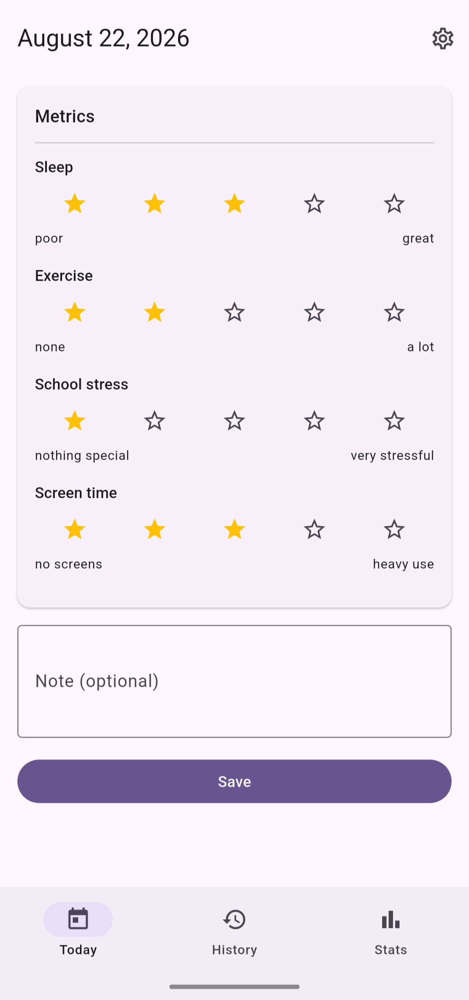
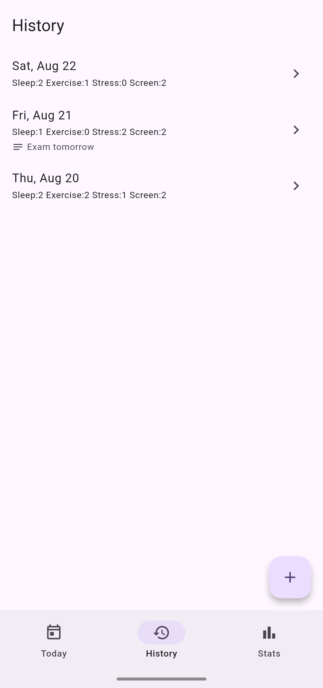
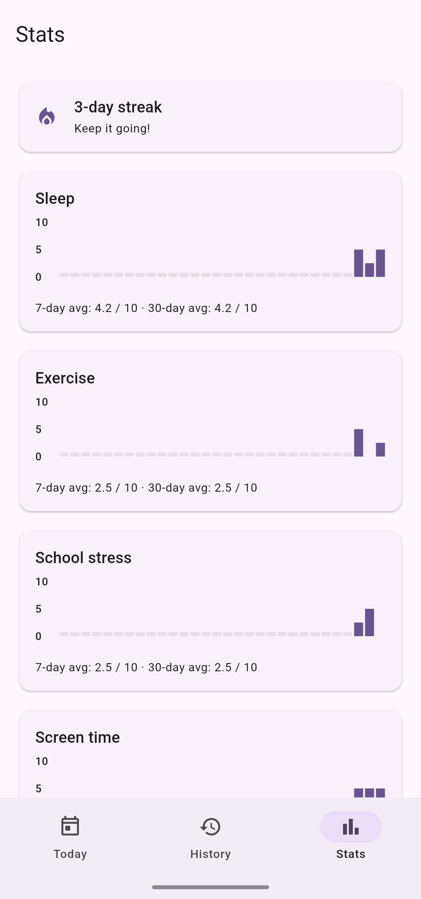
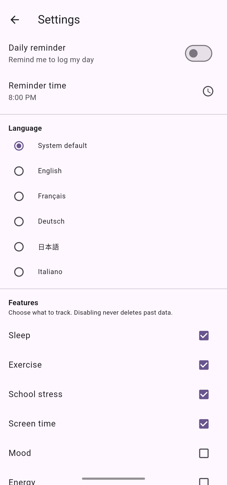

# Sleep Tracker

A daily wellness tracker for Android and iOS, built with Flutter. Log your sleep, exercise, stress, screen time, and up to twelve optional metrics, then review your trends, averages, and streaks over the past month.

## Features

- **Daily check-in.** Rate each enabled feature on a 0-4 scale, or use a simple switch for yes/no items. Add a note for anything worth remembering.
- **Configurable feature catalog.** Sleep, exercise, school stress, and screen time are enabled by default. Mood, energy, nutrition, physical pain, social, productivity, water, caffeine, alcohol, smoking, medication, and workday can be toggled in Settings. Disabling a feature never deletes the data you already logged.
- **History with backfill.** Browse past days and edit any entry. The plus button lets you add or edit a specific past date.
- **Stats view.** Each feature gets a 30-day chart. Ordinal ratings are normalized to a common 0-10 scale so different scales are comparable at a glance, with 7- and 30-day averages and a current streak. Boolean features show a frequency count (for example, 22 / 30 days).
- **Daily reminder.** Optional notification at a time you choose. Defaults to inexact timing on Android, so the system may deliver it a few minutes late.
- **CSV export.** Export your full history to a CSV file from Settings and share it through the OS share sheet (email, cloud storage, etc.). The file includes every column for every date, regardless of which features are currently enabled, so a disabled feature's history is never lost. Column headers are stable, raw field names (for example, `sleepRating`), so the file looks the same in any language.
- **Localized UI.** English, French, German, Japanese, and Italian, with an in-app language picker. Choosing "System default" follows the device language.
- **Privacy.** All data stays on the device in a local SQLite database. No accounts, no cloud, no analytics.

## Screenshots

| Today | History |
| --- | --- |
|  |  |

| Stats | Settings |
| --- | --- |
|  |  |

## Requirements

- Flutter 3.47 or newer (Dart 3.13)
- Android 8.0 or newer (minSdk 26), or iOS 15.0 or newer

## Building

```bash
flutter pub get
dart run build_runner build   # generates the Drift database code
flutter run
```

Notes:

- The Drift-generated files (`*.g.dart`) are gitignored, so a fresh checkout needs the `dart run build_runner build` step once before the first build.
- Localized strings are generated from the ARB files in `lib/l10n/` automatically during `flutter pub get` and builds (`generate: true` in `pubspec.yaml`), so no manual step is needed for those.

Release builds:

```bash
flutter build apk --release   # Android
flutter build ipa             # iOS
```

## Localization

All user-facing strings live in ARB files under `lib/l10n/`. `app_en.arb` is the template. Add or edit a key there first, then mirror it in the French, German, Japanese, and Italian files. `flutter gen-l10n` regenerates the Dart bindings (it also runs automatically during builds). The file `lib/l10n/untranslated.txt` lists keys missing from a non-template locale and should stay empty before shipping.

## Limitations

- Android and iOS only. The storage layer does not support web or desktop.
- One entry per date. Re-saving a date overwrites its entry, and entries cannot be deleted, only edited.
- Features come from a fixed catalog. Custom or user-defined metrics are not supported.
- The daily reminder uses inexact scheduling on Android and does not request the exact-alarm permission, so it may be delivered late under aggressive battery optimization.
- If the device language is not one of the five supported locales, the app falls back to English unless a language is chosen explicitly in Settings.
- Data lives in a local SQLite database. Uninstalling the app removes it. CSV export covers a full dump of the data, but there is no incremental backup, restore, or import feature.

